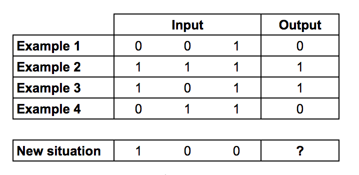
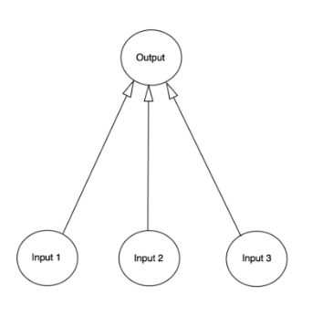

## Simple Neural Network 

Creating a simple neural network in Python with one input layer (3 inputs)and one output neuron. A neural network with no hidden layers is called a perceptron. In the training_version.py I train the neural network in the clearest way possible, but it's not really useable. The outputs of the training can be found in outputs.txt . neural_test.py is an object and can be used by giving in different inputs.

##What does it do?
The neural_test.py tries to predict the output given 3 binary inputs. If the first input is 1, the output should be one. Otherwise the output should be 0.

This is the truth table

 
 
 
This is the neurals diagram
 
 

